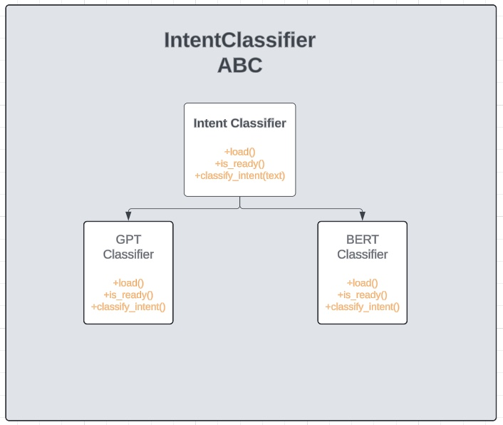
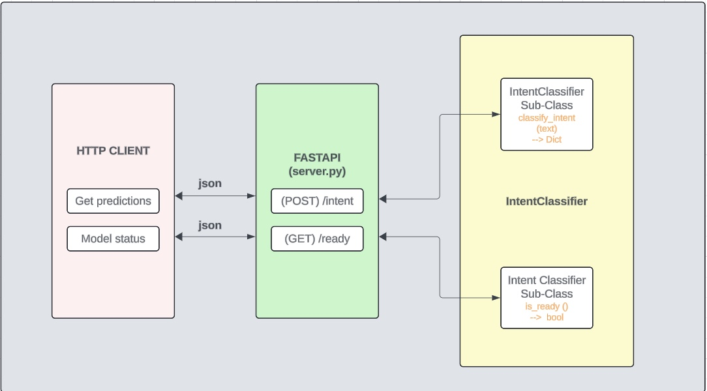
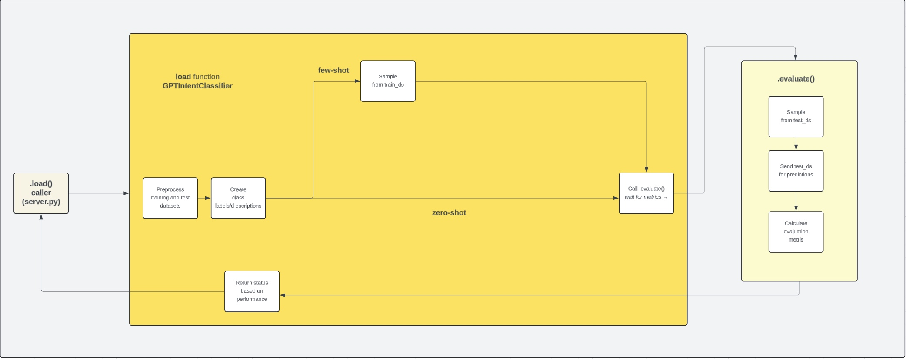

# Intent Classification Service

## Introduction 

This repository contains implementation of a GPT intent classification model using the OPENAI API.  

The model is trained to classify user queries into various intents related to aviation and aviation services like: `flight`, `airfare`, `ground_services` and more.   

The repository also includes a FastAPI script (`server.py`) that serves as an API endpoint to classify user queries using the model.  
You can send a POST request with a user query, and the API will respond with the 3 most possible intents.  

**Example response:** 

```json
{
 "intents": [{
   "label": "flight"
 }, {
   "label": "aircraft"
 }, {
   "label": "capacity"}]
}
```  

The implementation currently supports 2 classifier types:  

- `zero-shot`:  only the labels, names and a short description of the class is provided to the model as reference.  

**Example:** 

```
"""  
intent: flight_time  
description: This intent is about obtaining flight_time information  
label: [1]
"""  

"""  
intent: airfare  
description: This intent is about obtaining airfare information  
label: [2] 
"""  
```

- `few-shot`:  the labels, names and a at least one training example per class are provided to the model as reference.  

**Example:** (labels)  

```
"""  
intent: flight
label: [0]
"""

"""
intent: meal
label: [1]
"""
```

**Example:** (training examples)  

```
"""
text: cost fly Atlanta San Francisco
label: [0]
"""
 
"""
text: types meals available
label: [1]
"""
```  

The service is making requests to the `gpt-3-5-turbo` model by default.  
You can try other openai models according to your preference with `--model_name` startup argument, but keep in mind that only the `gpt-3-5-turbo` model has been tested.   

The architecture of the service allows for easy implementation & integration of other classifiers, that do not directly depend on `OPENAI API`.  
Only the GPT classifier is implemented at the momment, but you can see backbone of a valid intent classifier at [intent_classifier.py](./intent_classifier.py) and at [bert_intent_classifier..py](./bert_intent_classifier.py) that contains the skeleton of a `BERT` based classifier.   

You can use the default [train](./data/atis/train.tsv) & [test](./data/atis/test.tsv) datasets to get started.  
To add/remove intents or run the server using a custom dataset see [run_service_with_custom_dataset](./notebooks/run_service_on_custom_dataset.ipynb).   

## Architecture  

### **IntentClassifier**  

Each classifier implementation is defined by the abstract class IntentClassifier.   
This class defines 3 basic methods for all classifiers:  

- `load()`: loads the model **before** starting the server  
- `ready()`: checks model status   
- `classify_intent(text)`: classifies query (str)  

  
    


### **FastAPI**   

By defining an API (server.py) we can communicate with the model through HTTP requests as shown below:   
    
    


### **load() function**  

We use the load function to prepare the model for intent classification.  
Part of the GPTIntentClassifier `load()` function is the performance evaluation of the model **before** running the server.   


      


## Contents    

- [intent_classifier.py](./intent_classifier.py): Abstract base class for intent classifier implementations     
- [gpt_intent_classifier.py](./gpt_intent_classifier.py): Intent classifier using OpenAI's GPT models through OpenAI API  
- [bert_intent_classifier.py](./bert_intent_classifier.py): (Placeholder) Intent classifier using open source BERT MODEL from Hugging Face 
- [classifier_selector.py](./classifier_selector.py):  Selects classifier (`GPT`, `BERT`) based on the `classifier` argument   
- [server.py](./server.py): FastAPI script providing an API endpoint (`/intent`) for real-time intent classification  
- [Dockerfile](./Dockerfile): Dockerfile for AMD64 architecture  
- [run_container.sh](./run_container.sh): Bash script that builds and runs the container  
- [entrypoint.sh](./entrypoint.sh): Bash script that initiates the server with the given arguments  
- [notebooks folder](./notebooks/): Set of jupyter notebooks containing documentation, runtime logs, test cases etc.  
- [model_evaluation folder](./model_evaluation/): Evaluation metrics for each classifier type (`zero-shot` & `few-shot`)  
- [server_launch_examples](./server_launch_examples.ipynb): Examples of server launching & response validation testing  edge cases  


## Server Startup Arguments  

The server accepts the following command-line (or environmental) arguments:

- `--classifier <classifier_class>`: Specifies the classifier class to use. Options include 'GPT' or 'Bert'. **Default**: `GPT`.  
Environment variable: classifier  
- `--model <model_name>`: Specifies the name of the model to use. **Default**: `gpt-3.5-turbo`.  
Environment variable: model  
- `--classifier_type <classifier_type>`: Specifies the classifier type, either 'few-shot' or 'zero-shot'. **Default**: `zero-shot`.  
Environment variable: classifier_type  
- `--train_ds_path <train_dataset_path>`: Specifies the relative path to the training dataset in tsv format. **Default**: `./data/atis/train.tsv`.  
Environment variable: train_ds_path  
- `--test_ds_path <test_dataset_path>`: Specifies the relative path to the testing dataset in tsv format. **Default**: `./data/atis/test.tsv`.  
Environment variable: test_ds_path  
-  `--port <port_number>`: Specifies the port number on which the server should listen for incoming connections. **Default**: `8080`s.  
Environment variable: PORT  


## Setup

- navigate to project folder `intent-classifier-service`  
- create `.env` file inside the directory and place your `OPENAI_API_KEY`  

### 1. Using Docker 

For AMD64 architecture (Intel):  

- `chmod +x run_container.sh`, to make the script executable    
- `./run_container.sh`  to build and run the app 


Wait a couple of minutes for the container to build and the classifier service will start automatically with the default settings.   

### 2. Using python (3.11) and a virtual enviroment   

- create a virtual environment (e.g. `python3.11 -m venv venv`)  
- activate it (e.g. `source venv/bin/activate`)  
- install requirements (e.g. `pip install -r requirements.txt`)  
- run the app (e.g. `python server.py`) with default parameters  
- **OR** use the [entrypoint.sh](./entrypoint.sh) file to alter configuration parameters  
    -  `chmod +x entrypoint.sh` , to make the script executable  
    -  `./entrypoint.sh`  run the app with specified parameters  


Wait a few seconds for the model to load and once the server is up you can use [make_requests notebook](./notebooks/make_requests.ipynb) to make your requests and test the API. 
You can also test the examples and edge cases in [endpoint_testing notebook](./notebooks/endpoint_testing.ipynb) yourself!  

Note:  During loading the service will make 30 requests to openAI for evaluation purposes.  
  
You'll soon see the model evaluation metrics in your console. For detailed explanations on these metrics, refer to [evaluation_metrics_notebook](./notebooks/evaluation_metrics.ipynb). Explore [gpt_model_loader_notebook](./notebooks/gpt_model_loader.ipynb) for  examples of few-shot and zero-shot loading outputs.  


## Futher Reading  

Navigate the codebase and the [notebooks](./notebooks/) folder to see:  

- [data_exploration](./notebooks/data_exploration.ipynb): Insights and visuals based on the given `train` and `test` datasets  
- [data_management](./notebooks/data_management.ipynb): Definitions of Classes (intents), training and evaluation data sampling logic,  addition of new intents, input preprocessing and response validation  
- [run_service_with_custom_dataset](./notebooks/run_service_on_custom_dataset.ipynb): Run service using custom dataset  
- [evaluation_metrics](./notebooks/evaluation_metrics.ipynb): Definition of each evaluation metric, evaluation outputs & costs for the 2 classifier types (`zero-shot`, `few-shot`).  
See [model_evaluation_folder](./model_evaluation/) for detailed results and confusion matrices   
- [endpoint_testing](./notebooks/endpoint_testing.ipynb): Test server responses of `/intent` endpoint on normal and edge cases. Detailed documentation of endpoint expected responses in found  
at [assignment.md](./Assignment.md)  
- [gpt_model_loader](./notebooks/gpt_model_loader.ipynb): Detailed explanation of the `model.load()` function for the GPT classifier  
- [initial_codebase_bug](./notebooks/initial_codebase_bug.ipynb): Bug found in original codebase  
- [test_gpt_classifier (deprecated)](./notebooks/test_gpt_classifier_functionality.ipynb): Initial approach of the gpt classifier service   
